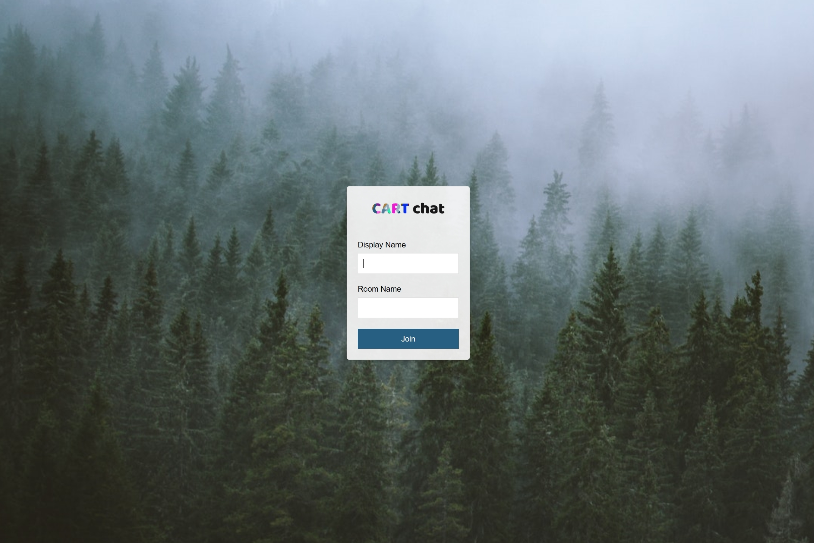

# CART 263 Node.js chat demo


Hello CART 263! Follow the instructions below to get started.

In your console application of choice (in MacOS - terminal.app), use git to copy this project to your current directory. You must have the git command line tools installed fo that first line to work. Else, you can download this repo as an archive and unzip it, ensuring that you are in the right directory within the command line.

You can find out where you are in MacOS and Linux with the `ls` command, and on Windows with `DIR`. It's highly reccomended that you switch away from PowerShell or cmd if you plan on developing on Windows.

```bash
$ git clone https://github.com/stockHuman/C263-Node-demo.git
$ cd C263-Node-demo
$ npm install
$ npm start
```
Have fun! Note that chats are volatile - they don't persist after a refresh of the client or server.
